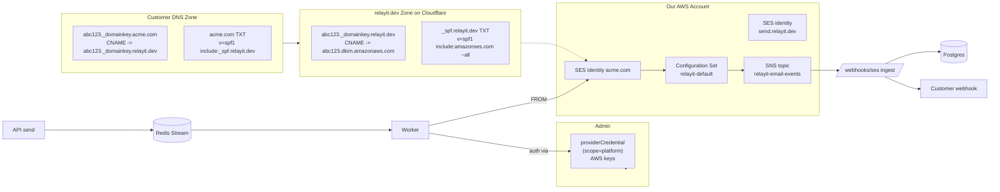

## What changed from the previous plan

1. **BYO is preserved**, not dropped. Routes are gated on `env.EDITION` (already wired in [apps/api/src/env.ts](apps/api/src/env.ts)). OSS keeps the existing `/integrations` user flow; cloud hides it from end-users and routes credential management through admin-only endpoints.
2. **Backend-only** in this iteration — no web work; the onboarding wizard moves to a follow-up.
3. **better-auth admin plugin** is added in cloud edition. Admins (a) manage the platform's `providerCredential` rows that are used to send everyone's email, and (b) get user/org/session management out of the box (impersonation, ban, etc.).
4. **Sender flow works in both editions.** Cloud uses Cloudflare-proxied DNS to hide AWS; OSS shows direct `*.dkim.amazonaws.com` records and the customer uses their own BYO `providerCredential`. The `sender` table carries the `providerCredentialId` FK so the worker always knows which credentials to use when sending from that sender. For email senders (identityKind=domain), once verified callers can send from any `local@domain` on it; per-localpart registration is not required.
5. **Platform AWS region**: recommendation is **single AWS account in `us-east-1`** for v2. Reasoning: largest SES quotas, lowest cross-AWS latency, broadest production-access approval track record, and cheapest egress to SNS/CloudWatch which we'll lean on. Customers' DNS records resolve globally regardless of SES region, so this is a purely operational choice for now. The priority/fallback hook in [process-event.ts](apps/api/src/worker/lib/process-event.ts) is the seam for adding eu-west-1 (or a second AWS account) later without schema churn — at the cost of doubling the CNAMEs customers paste.
6. **Multi-provider failover**: not built now (single us-east-1 SES). Existing priority/fallback machinery stays wired up.

## Architecture (cloud edition)



## Edition gating

A single helper, `IS_CLOUD = env.EDITION === "cloud"`, governs:

- **Route mounting** in [apps/api/src/server/routes/organization/index.ts](apps/api/src/server/routes/organization/index.ts): `/integrations` mounts only when `!IS_CLOUD`; `/senders` mounts in **both** editions.
- **Admin namespace**: a new `/admin/*` tree mounts only when `IS_CLOUD`.
- **better-auth plugin set** in [apps/api/src/server/lib/auth/index.ts](apps/api/src/server/lib/auth/index.ts): `admin(...)` enabled in **both** editions (multi-tenant OSS deployments). `stripe(...)` enabled **only in cloud** (gated on `IS_CLOUD`); OSS skips Stripe entirely and uses flat override-column quotas.
- **Domain creation flow** branches on `IS_CLOUD`:
  - **Cloud**: pick the highest-priority active `scope='platform'` `providerCredential` automatically; create CNAMEs in the `relayit.dev` Cloudflare zone; expose proxied records (`*._domainkey.relayit.dev`) to the customer.
  - **OSS**: caller supplies (or the route defaults to) an org-scope `providerCredential`; no Cloudflare calls; expose direct AWS records (`*.dkim.amazonaws.com`) to the customer. `proxyCloudflareId` stays null. `_spf.relayit.dev`/sandbox features are only available if the OSS operator has configured their own `MANAGED_ROOT_DOMAIN` and parent identity.
- **Send resolver**: identical in both editions — parse `from` → `sender` → `providerCredential`. The only difference is which scope the FK happens to point at.

## Data model changes

### 1. `providerCredential` scope refactor

Currently `providerCredential.organizationId` is `notNull`. In cloud, the AWS keys belong to the platform, not any customer org. Three options were considered (singleton "platform" org, nullable org id with a `scope` column, separate table). Cleanest is the **scope column with nullable org id**:

- Add enum `provider_scope`: `org` | `platform`.
- Add column `scope` to `providerCredential` (default `org`).
- Make `organizationId` nullable. Add a check constraint: `scope = 'org' ⇔ organization_id IS NOT NULL`.
- Update unique indexes to include `scope`:
  - `(scope, organizationId, channelType)` where `isDefault = true`
  - `(scope, organizationId, channelType, priority)`
  - For platform rows, `organizationId IS NULL` so the index degenerates to `(scope='platform', channelType, …)`.
- Backfill migration: set `scope='org'` on all existing rows. The existing `findProviderIdentity` in [apps/api/src/server/routes/send/utils.ts](apps/api/src/server/routes/send/utils.ts) gets a `scope` filter (`'org'` for OSS callers, `'platform'` for cloud send).

This means the admin in cloud uses the same `providerCredential` + `providerIdentity` plumbing, just with `scope='platform'` rows. All your encryption, fallback, and registry code stays.

### 2. Channel-agnostic `sender` + `sender_dns_record` tables

Every provider verifies *something* before letting you send through it. The shape of that "something" varies: SES verifies a domain, Twilio "verifies" a phone number you bought, WhatsApp verifies a business account, Discord registers a bot. Rather than per-channel tables (email-only `domain`, future SMS-only `phone_number`, …) we use one channel-agnostic `sender` table; channel-specific specialization happens via a registry-controlled `identityKind` text column + a `providerData` jsonb.

- New enum `sender_status`: `pending`, `verifying`, `verified`, `failed`, `paused`.
- New table `sender` (`apps/api/src/db/schema/provider.ts`):
  - `id`, `organizationId` (cascade), `providerCredentialId` (restrict — required; points to a platform-scope row in cloud or an org-scope row in OSS).
  - `channelType` (`email` for now; `sms`/`whatsapp`/`discord` later).
  - `identityKind text` — registry-controlled string identifying *what kind of identity this row represents*: `domain` for email, `phone_number` / `messaging_service` for SMS, `business_account` for WhatsApp, `bot` for Discord, etc. Not a pg enum so adding channels doesn't need migrations.
  - `identifier text` — the literal identifier the provider sees: `"acme.com"`, `"+14155551234"`, a WABA id, …
  - `isSandbox boolean` — channel-agnostic flag for shared-parent sandbox identities (today: `<slug>.send.relayit.dev` under our SES parent identity; future: shared Twilio test numbers, shared WhatsApp test WABA, …). Replaces the old `domain_kind` enum's `sandbox_subdomain` value.
  - `status` (`sender_status` enum above).
  - `providerData jsonb` — channel/provider-specific bag: SES identity ARN, DKIM tokens, MAIL FROM domain, Twilio number SID, WABA verification metadata, etc. TODO: type via the provider registry's `senderConfigSchema`.
  - `verifiedAt`, `lastCheckedAt`, `createdAt`.
  - Unique `(organizationId, channelType, identifier)`.
  - `providerCredentialId` is the source of truth for "which credentials does the worker use when sending from this sender?" — this is what makes the send path identical across editions and channels.
- New table `sender_dns_record` (only populated for senders with `identityKind ∈ {"domain"}`):
  - `id`, `senderId` (cascade), `purpose` (`dkim1`|`dkim2`|`dkim3`|`spf`|`dmarc`|`mail_from_mx`|`mail_from_spf`), `recordType` (`CNAME`|`TXT`|`MX`), `customerName`, `customerValue`, `proxyCloudflareId` (Cloudflare record id we own in `relayit.dev`, nullable for records customer owns outright), `lastSeenValue`, `lastCheckedAt`.
- Auto-create vs manual-verify is **registry-driven business logic at the API layer**, not a schema concern. The provider config in `apps/api/src/providers/list/*.ts` declares `channels.<channel>.verificationFlow: 'manual' | 'auto'`; the sender route branches on that. Schema sees `status` either way.

### 3. `message_event` split into two tables

The old `message_event` table conflated two unrelated lifecycles into one row shape, with SES-specific columns baked in (`sesMessageId`, `providerRequestId`). It also carried the now-orphaned `identityId` from the deleted `provider_identity` table. We replace it with two tables driven by their actual writers.

#### `message_attempt` table (replaces `message_event`)

Written exclusively by the worker. One row per send attempt. Status enum narrows to **worker states only**: `queued`, `processing`, `sent`, `failed`, `malformed`, `rendering_failed`.

- `id`, `messageId` (cascade), `attemptNumber`.
- `senderId` (cascade) — the chain `sender → providerCredential` carries channel-specific structure off the hot path. Channel-agnostic.
- `fromSnapshot text` — channel-agnostic snapshot of the From at attempt time; for email this is the full From header (`Acme <noreply@acme.com>`); for SMS it'll be the E.164 number.
- `providerCredentialId` (denormalized; restrict) — survives `sender` deletion via the snapshot. Speeds up dispatch lookup.
- `providerType`, `channelType` — denormalized discriminators so the webhook ingest can route without joins.
- `providerMessageId text` — the **one** externally-routable id from the provider response (SES `MessageId`, Postmark `MessageID`, SendGrid `X-Message-Id`, Twilio `Sid`, …). Partial unique on `(providerType, providerMessageId)` where not null.
- `providerData jsonb` — untyped for now (TODO comment in code); will be typed via the provider registry's `eventDataSchema` in a follow-up. Holds request id, raw ack body, etc.
- `error jsonb` — keeps the existing `MessageEventError`-shaped data; renamed to `MessageAttemptError`.
- `retryable`, `responseTimeMs`, `startedAt`, `completedAt` — unchanged from the old `message_event`.

#### `message_delivery_event` table (new)

Written exclusively by the provider webhook ingest (e.g. `POST /webhooks/ses`). Zero-to-many rows per attempt. Kind enum narrows to **provider-reported states only**: `delivered`, `bounced`, `complained`, `opened`, `clicked`, `rejected`, `deferred`.

- `id`, `messageAttemptId` (cascade), `messageId` (denormalized for cheap "did this message bounce?" queries).
- `kind` (enum above).
- `providerType`, `channelType` — denormalized.
- `eventData jsonb` — untyped for now (TODO comment); the full normalized webhook payload. Same registry-typed follow-up as `providerData`.
- `occurredAt` — provider-reported timestamp.
- `receivedAt` — when our webhook handler stored it (defaults to `now`).

#### Things deleted in this iteration

- The `domain` and `domain_dns_record` tables (collapsed into the channel-agnostic `sender` / `sender_dns_record` above).
- The `domain_kind` enum (replaced by registry-controlled `identityKind` text + the channel-agnostic `isSandbox` boolean).
- The legacy `identityId` column and any back-compat plumbing. The `provider_identity` table is already gone; this finishes the cleanup.
- `sesMessageId` and `providerRequestId` as named columns — both fold into the generic `providerMessageId` + `providerData` pair.
- The old combined `messageStatusEnum` with 12 values — replaced by two narrow enums whose rows always have meaningful columns.

### 4. Status enums + quotas

- Drop the combined `AVAILABLE_MESSAGE_STATUSES` in [packages/shared/src/providers/index.ts](packages/shared/src/providers/index.ts). Replace with two:
  - `AVAILABLE_MESSAGE_ATTEMPT_STATUSES`: `queued`, `processing`, `sent`, `failed`, `malformed`, `rendering_failed`.
  - `AVAILABLE_MESSAGE_DELIVERY_EVENT_KINDS`: `delivered`, `bounced`, `complained`, `opened`, `clicked`, `rejected`, `deferred`.
- Quotas are now plan-derived in cloud and `*Override`-column-derived in OSS — see the [Billing](#billing-cloud-edition-only) section below for the full resolution chain. Net effect on the org schema: instead of flat `dailySendLimit` / `monthlySendLimit` columns, the organization gets nullable `dailySendLimitOverride` / `monthlySendLimitOverride` columns plus a `billingUserId` FK. Counters live in Redis keyed by `billingUserId` (cloud) or `orgId` (OSS), incremented before queueing.

### 5. better-auth admin plugin schema

Per the docs in [/Users/tedtoo/.cursor/projects/Users-tedtoo-Desktop-projects-relayit/uploads/admin-0.md](/Users/tedtoo/.cursor/projects/Users-tedtoo-Desktop-projects-relayit/uploads/admin-0.md):

- Add `role text`, `banned boolean`, `banReason text`, `banExpires timestamp` to `user` in [apps/api/src/db/schema/auth.ts](apps/api/src/db/schema/auth.ts).
- Add `impersonatedBy text` to the session table (note: session is currently in the redis secondary storage in [apps/api/src/server/lib/auth/index.ts](apps/api/src/server/lib/auth/index.ts) — confirm whether better-auth still requires the column on the persisted session table).
- Run `bunx @better-auth/cli generate` to confirm the exact migration shape.

## API surface

### Admin-only (cloud)

Mounted under `/admin` only when `IS_CLOUD`. Auth guard: better-auth admin plugin's role check.

- `POST /admin/providers` — create a `providerCredential` with `scope='platform'`. Body matches existing `createIntegrationSchema`. Encrypts via `encryptRecord` like the existing org route.
- `GET /admin/providers` — list platform credentials with default/priority/active.
- `PATCH /admin/providers/:id` — toggle active/default/priority.
- `DELETE /admin/providers/:id`.
- `POST /admin/providers/:id/identities` — register platform identities (e.g. the verified SES identity `send.relayit.dev` for the shared sandbox).
- `GET /admin/orgs` — list all orgs with current quota usage, sender count, paused flags. Pagination via better-auth admin.
- `POST /admin/orgs/:id/pause` / `unpause` — set a paused flag on the org (new boolean column on `organization`).
- `GET /admin/senders` — list every sender across orgs with status + reputation snapshot (filter by channel/status).

The better-auth admin plugin itself exposes `/admin/list-users`, `/admin/ban-user`, `/admin/impersonate-user`, etc. We don't need to wrap those — they come for free once the plugin is enabled.

### Org-scoped (both editions)

Mounted under `/organization/:slug`.

- `POST /senders` — create a sender. Body carries `channel`, optional `identityKind` (defaults are registry-chosen per channel), and the channel-appropriate identifier (e.g. `{ channel: "email", identifier: "acme.com" }`).
  - Resolve target `providerCredential`:
    - Cloud: highest-priority active `scope='platform'` row for the requested channel (no body field needed).
    - OSS: body field `providerCredentialId`, or default to the org's highest-priority active `scope='org'` row for the channel. 404 if none exists ("create an integration first").
  - Branch on the registry's `verificationFlow` for this provider × channel:
    - **manual** (today: email/SES): call `ses-admin.createIdentity({ credential, fqdn })` → get 3 DKIM tokens. **Cloud only**: for each token, call Cloudflare API to create `{token}._domainkey.relayit.dev → {token}.dkim.amazonaws.com`. Idempotently ensure `_spf.relayit.dev TXT "v=spf1 include:amazonses.com ~all"`. Insert `sender` (`status='pending'`, `identityKind='domain'`, `providerCredentialId` set) and the `sender_dns_record` rows the customer must add:
      - **Cloud**: 3× `CNAME {token}._domainkey.{fqdn} → {token}._domainkey.relayit.dev` + 1× `TXT {fqdn} → "v=spf1 include:_spf.relayit.dev ~all"` + optional DMARC.
      - **OSS**: 3× `CNAME {token}._domainkey.{fqdn} → {token}.dkim.amazonaws.com` + 1× `TXT {fqdn} → "v=spf1 include:amazonses.com ~all"`.
    - **auto** (future: SMS/Twilio): perform the provider-side acquisition (buy a number, register a bot, etc.); insert sender with `status='verified'` directly.
- `POST /senders/sandbox` — only enabled when `IS_CLOUD` (or when an OSS operator has configured `SANDBOX_PARENT_DOMAIN`). For email: issues `<slug>.send.relayit.dev`, creates a sender row with `status='verified'`, `identityKind='domain'`, `isSandbox=true`, and `providerData.sesIdentityArn` pointing at the parent identity (SES subdomain inheritance accepts sends from any `*.send.relayit.dev` without per-subdomain identity creation). When other channels gain sandbox support (e.g. a shared Twilio test number) this route grows new branches.
- `GET /senders` — list with `sender_dns_record` joined; filterable by channel/status.
- `POST /senders/:id/verify` — synchronous re-check: dispatch to the registry's per-provider verifier. For SES, call `ses-admin.getIdentity` → if `VerifiedForSendingStatus` is true and `DkimAttributes.Status == 'SUCCESS'`, set `sender.status='verified'` and `verifiedAt = now`. Otherwise update `lastCheckedAt` and return current state.
- `DELETE /senders/:id` — delete the provider-side identity via the linked credential, delete Cloudflare records via `proxyCloudflareId` (no-op in OSS for email; no-op for non-email channels).

### Send-time changes

In [apps/api/src/server/routes/send/utils.ts](apps/api/src/server/routes/send/utils.ts):

- Add `findActiveSender({ orgId, channel, fromIdentifier })`:
  - Parse `fromIdentifier` to the channel-appropriate sender identifier (email → `fqdn` from the address; sms → `+E.164` itself; etc.).
  - Find `sender` where `(organizationId, channelType=channel, identifier=parsedIdentifier)`, `status='verified'`, not paused, joined with its `providerCredential`.
  - Return `{ sender, providerCredential }` (plus channel-specific extras like `localPart` for email, attached to the caller's choice).
- In [raw.ts](apps/api/src/server/routes/send/using/raw.ts) and [template.ts](apps/api/src/server/routes/send/using/template.ts): insert a `message_attempt` row with `senderId`, `providerCredentialId`, `providerType`, `channelType`, and `fromSnapshot` (the literal From / from-number at request time). Delete `findProviderIdentity` outright — the `provider_identity` table no longer exists and back-compat is not a goal.
- Quota enforcement: resolve caps via the chain in the [Billing](#billing-cloud-edition-only) section. Counters are keyed by **org + channel**: `quota:org:{orgId}:{channel}:{yyyymm}` (always) and `quota:org:{orgId}:{channel}:{yyyymmdd}` (only when the resolved daily cap is finite). `INCR` before queue insert; if any cap is crossed, `DECR` and return `429` with a billing-portal link header (cloud) or a plain `quota exceeded` body (OSS). Also check `organization.isPaused` (org-wide) and `organization_channel.isPaused` (channel-scoped) before the counter — paused orgs/channels short-circuit with `403`.

### SES events ingest

- `POST /webhooks/ses` (public, no auth, but SNS signature-verified).
  - Handle `SubscriptionConfirmation` once per topic (call the `SubscribeURL` to confirm).
  - For `Notification`: parse `Message` body (it's a JSON string containing the SES event), extract `mail.messageId`, look up the matching `message_attempt` by `(providerType='aws', providerMessageId=mail.messageId)`, insert a `message_delivery_event` row with the matching `kind` and the raw payload in `eventData`. If the org has a configured webhook target, enqueue a fan-out job.
- Configuration set + event destination are admin-managed via `ses-admin.putConfigurationSet` + `putEventDestination`. We document the one-time setup but also expose it as an admin API call so the admin can re-run idempotently.

## Worker / send path changes

In [apps/api/src/worker/providers/aws/ses.ts](apps/api/src/worker/providers/aws/ses.ts):

- Same `providerCredential` shape regardless of edition; decryption path is unchanged.
- Migrate from the legacy `@aws-sdk/client-ses` `SendEmailCommand` to `@aws-sdk/client-sesv2`. Required for `ConfigurationSetName` + `FromEmailAddressIdentityArn` (the latter is what lets sandbox subdomains send under the parent identity).
- Always pass `ConfigurationSetName: env.SES_CONFIGURATION_SET` so events fire.
- For email senders where `isSandbox=true`, pass `FromEmailAddressIdentityArn: sender.providerData.sesIdentityArn` (which points to the parent identity).
- Capture `result.MessageId` and persist to `message_attempt.providerMessageId` (and the rest of the response into `providerData`).

In [apps/api/src/worker/lib/process-event.ts](apps/api/src/worker/lib/process-event.ts):

- Rename to operate on `message_attempt` rows (the function name will change from `fetchEventDetails` to `fetchAttemptDetails`).
- `fetchAttemptDetails` returns `{ attempt, sender, providerCredential, message, contact, identifiers }` (the credential FK on `sender` makes this a single join chain, no edition- or channel-aware branching needed).
- No legacy `identityId` path — `provider_identity` is gone.
- Provider dispatch stays in `PROVIDER_REGISTRY[providerType][channelType]`.
- After provider call: persist `providerMessageId` + raw response into the attempt row's `providerData` jsonb (later: typed by the registry).
- Fallback in `apps/api/src/worker/lib/fallback.ts` rewrites to walk `providerCredential`s for the same `senderId` (or for the same org+channel as a broader fallback). In cloud, fallback iterates other `scope='platform'` credentials (priority order) — the seam for adding a second SES region later.

## Multi-provider failover recommendation

Three realistic options for backup:

1. **Single SES region (status quo)**: One AWS account, one region. Simplest. SES regional outages exist but are rare and short. **Risk: minutes-to-hours of downtime once every couple of years.**
2. **Multi-region SES, one AWS account**: Two `providerCredential` rows (`scope=platform`, different region in the unencrypted slot). Verify each customer sender in both regions (one `sender` row per region, identifier still the same fqdn but different `providerData`). DKIM tokens differ per region, so customer DNS would need 6 CNAMEs instead of 3. Worker uses priority for primary/secondary. **Risk: customer-facing complexity in onboarding doubles.**
3. **Cross-vendor fallback (e.g. SES → SendGrid/Postmark)**: Add a second provider adapter. Create a parallel `sender` row per vendor (same identifier, different providerCredential/providerData). Heavy ongoing customer-onboarding overhead. **Risk: real cost is keeping two provider integrations healthy plus customer DNS UX.**

Recommendation for this iteration: **option 1 (no failover) but keep all the scaffolding (`priority`, `isDefault`, `findFallbackProvider`) intact.** When you outgrow it, option 2 is a backend-only change. Option 3 should wait until you have customers genuinely demanding 99.99%+ SLAs.

## Cloudflare + SES integration modules

- `apps/api/src/integrations/cloudflare/index.ts` – wraps `https://api.cloudflare.com/client/v4/zones/{zoneId}/dns_records`. Methods: `createCname({ name, content })`, `createTxt({ name, content })`, `deleteRecord(id)`, `getRecord(id)`, `findRecord({ name, type })`. Idempotent helpers.
- `apps/api/src/integrations/aws/ses-admin.ts` – wraps `SESv2Client`. Methods: `createIdentity`, `getIdentity`, `setMailFrom`, `deleteIdentity`, `putConfigurationSet`, `putEventDestination`. Always accepts a `providerCredential` (decrypted) so the same module serves both OSS BYO admin paths and cloud platform paths.
- Env additions in [apps/api/src/env.ts](apps/api/src/env.ts):
  - `MANAGED_ROOT_DOMAIN` (default `relayit.dev`), `SANDBOX_PARENT_DOMAIN` (default `send.relayit.dev`)
  - `CLOUDFLARE_API_TOKEN`, `CLOUDFLARE_ZONE_ID` — required when `EDITION=cloud`, optional otherwise (use `.refine()` on the zod schema).
  - `SES_CONFIGURATION_SET` (default `relayit-default`)
  - Note: no `AWS_ACCESS_KEY_ID` / `AWS_SECRET_ACCESS_KEY` in env — those live encrypted in `providerCredential` rows created by the admin.

## Reputation guard

Background job (runs every 5 min):
- For each `sender` with `status='verified'`, compute bounce rate and complaint rate over the trailing 24h from `message_delivery_event` rows. (For now this only fires on email senders; SMS/WhatsApp senders won't have bounce/complaint signals in this iteration.)
- If a single sender crosses bounce > 5% or complaint > 0.1% AND its total sends > 1000 (sample-size floor), set `sender.status='paused'` (the identity-level pause already in the senders schema). Insert an audit event on the org.
- If multiple senders in the same org+channel cross thresholds in the same window, escalate: upsert `organization_channel` for that (orgId, channel) with `isPaused=true`, `pausedReason='abuse_detected'`. Channel-level pause beats per-sender pause for a noisy tenant.
- Admins can unpause senders via `/admin/senders/:id/unpause` (sender-level) or the channel-level pause via `PATCH /admin/orgs/:id/channels/:channel` (channel-level).

## Billing (cloud edition only)

Cloud-only. OSS edition does not load `@better-auth/stripe` and uses the org-level quota override columns directly. The thesis: cloud's edge is not features — it's "no AWS account, no SES production approval, branded DNS, warmed shared IPs, managed reputation, future multi-region failover, compliance posture." Pricing reflects convenience, not capability gating.

### Mental model: orgs are projects, plan tier caps how many you can own

The product treats each `organization` as a **project** — an isolated tenant with its own senders, API keys, contacts, message history, and quota pool. One human user can own multiple projects (e.g. one for production, one for staging, one for a client engagement).

The subscription is keyed on the **user** (`customerType: "user"`). Each plan declares a fixed `limits.projects` count — the maximum number of orgs the billing user can own. To run more projects than your plan allows, you upgrade tier; there's no per-seat add-on. Each owned project gets the **full** per-plan quota allotment — quotas are not pooled across a user's projects, because projects are conceptually independent.

`limits.projects` is not "number of teammates with access" — members can be invited to any org regardless via the existing `member` table — it's "number of orgs this user can be the billing owner of." This is essentially a fixed-bundle version of Vercel/Railway/Render per-project billing without the seat math.

### Tiers

Single product line keyed on per-project monthly email send volume. No channel add-ons in this iteration (only email ships; SMS/WhatsApp slot in later as nested entries under `limits.{channel}`). All caps enforced as hard limits with `429 Too Many Requests` + billing-portal link in the response body — no metered overages in v1. No free trial on paid plans — the free tier IS the trial.

| Plan | Monthly | Annual (2 mo free) | Projects | Per-project sends/mo | Per-project daily cap | Custom domains/project | Retention | SLA | Support |
|------|---------|---------------------|----------|----------------------|-----------------------|------------------------|-----------|-----|---------|
| `free`      | $0      | $0           | 1 | 3,000   | 100       | 1 + sandbox | 7d  | —      | Community |
| `signal`    | $15/mo  | $150/yr      | 3 | 50,000  | unlimited | unlimited   | 30d | 99.9%  | Email, best-effort |
| `broadcast` | $99/mo  | $990/yr      | 5 | 250,000 | unlimited | unlimited   | 90d | 99.95% | Priority email |
| Enterprise (off-Stripe) | Custom | — | Custom | Custom | Custom | unlimited | Custom | 99.99% | Dedicated, SOC2/DPA |

Naming theme: `signal` (you're transmitting) → `broadcast` (you're transmitting at scale) leans into the relay/transmission metaphor that's already in the product name.

Price-point reasoning:
- **Free** matches Resend's 3k/mo on volume so we don't lose head-to-head evals. Free is locked to a single project — you can't multi-project on free.
- **Signal** at $15/mo lands 25% under Resend Pro ($20) for the same 50k/mo per project, and includes 3 projects vs. their 1.
- **Broadcast** at $99/mo matches Resend Scale ($90) at 2.5× the per-project volume (250k vs 100k) AND 5 projects. Maximum aggregate throughput on Broadcast: 5 × 250k = 1.25M emails/mo for $99. Past that point, Enterprise.

### Billing entity & ownership

`customerType: "user"`. The subscription's `referenceId` is the user id; one user, one active subscription.

The v2 schema is org-tenanted, and better-auth's org plugin allows multiple `member.role='owner'` rows per org. We need a deterministic answer to "which user's subscription pays for this org's sends?" Add one column on `organization`:

- `billingUserId text references user(id) on delete restrict not null` — single billing-owner per org. Defaults to the creator on `POST /organization`. Transferable via `PATCH /organization/:slug/billing-owner` (must be a current org owner, and the target user must have an available project slot on their subscription).

When an org is created, the API hook checks: `count(orgs where billingUserId = currentUser AND isPaused = false) < currentUser.plan.limits.projects` (defaults to free's `1` if no active subscription). If at cap, return `402 Payment Required` with `X-Relayit-Billing-Portal` pointing at the upgrade flow.

### Per-channel state: the `organization_channel` table

Channel-scoped state (pause, quota overrides, channel-specific config) lives in a separate table, not on `organization`, because plan limits are already per-channel (`limits.email.{…}`) and the reputation guard needs to pause one channel without touching others. One table, one row per `(orgId, channelType)` pair — NOT one table per channel, because adding a channel must stay a code-only change.

```ts
export const organizationChannel = pgTable("organization_channel", {
  id: text("id").primaryKey().$defaultFn(() => typeid("ochn").toString()),
  organizationId: text("organization_id")
    .notNull()
    .references(() => organization.id, { onDelete: "cascade" }),
  channelType: channelEnum("channel_type").notNull(),

  isPaused: boolean("is_paused").default(false).notNull(),
  pausedReason: pausedReasonEnum("paused_reason"),
  pausedAt: timestamp("paused_at"),

  dailySendLimitOverride: integer("daily_send_limit_override"),
  monthlySendLimitOverride: integer("monthly_send_limit_override"),

  config: jsonb("config").default({}).notNull(), // registry-typed later

  createdAt: timestamp("created_at").defaultNow().notNull(),
  updatedAt: timestamp("updated_at").$onUpdate(() => new Date()).notNull(),
}, (t) => [
  uniqueIndex("organization_channel_org_channel_unique_idx").on(t.organizationId, t.channelType),
  index("organization_channel_org_idx").on(t.organizationId),
]);
```

**Pause hierarchy** — keep `organization.isPaused` alongside this. They mean different things:

| Level | Triggered by | Effect | Reason values typically used |
|---|---|---|---|
| `organization.isPaused` | Plan downgrade with excess projects, subscription canceled, admin abuse-pause | All channels blocked | `plan_downgrade`, `subscription_canceled`, `admin_pause` |
| `organizationChannel.isPaused` | Channel quota hit, reputation guard, channel-scoped admin pause | Only that channel blocked | `quota_exceeded`, `abuse_detected`, `admin_pause` |

Both share the existing `pausedReasonEnum` — no split needed.

**Bootstrap**: lazy. No row created on org creation. A row is inserted the first time the org does something channel-specific: creates a sender on that channel, creates a `provider_credential` for it, or an admin sets an override / pause. A `getOrgChannel(orgId, channelType)` helper returns the row or a synthesized default (`isPaused=false`, both overrides `null`, empty `config`). Absent row = all defaults.

**What's NOT in this table (deliberately)**: a `defaultProviderCredentialId` or `defaultSenderId` column. The existing `provider_credential.isDefault` + `priority` are already the source of truth for credential selection. Adding a second "default" pointer creates two truths to keep in sync; revisit only if resolution logic gets fork-y.

### Quota resolution

Send-path resolution (in [send/utils.ts](apps/api/src/server/routes/send/utils.ts)):

1. Resolve `sender.organizationId` → load `organization`. If `organization.isPaused`, return `403 Forbidden` with `pausedReason` body.
2. Load `organization_channel` for `(orgId, sender.channelType)` via the `getOrgChannel` helper. If `org_channel.isPaused`, return `403 Forbidden` (admin/abuse pause) or `429 Too Many Requests` (quota_exceeded) with `pausedReason`.
3. Resolve effective per-channel limits — pick the first non-null at each cap:
   1. `organization_channel.{*}Override`
   2. **Cloud**: `plan.limits[channel].{*}` where `plan` comes from `organization.billingUserId → user.subscription` (free plan as fallback for inactive/missing subscriptions).
   3. **OSS**: hardcoded fallback (`monthlySends=3000`, `dailySends=100` for email).
4. Counter is **keyed by org + channel**: `quota:org:{orgId}:{channel}:{yyyymm}` (always) and `quota:org:{orgId}:{channel}:{yyyymmdd}` (only when the resolved `dailySends` is finite).
5. `INCR` the relevant counter(s); if any cap is crossed, `DECR` the increments, set `org_channel.isPaused=true` + `pausedReason='quota_exceeded'` if monthly was hit (auto-unpaused on month rollover; reputation/abuse pauses are sticky and admin-only-clearable), and return `429` with `Retry-After` (next period boundary in UTC) and an `X-Relayit-Billing-Portal` header (cloud only).

### Plan definition (auth config)

Plans are nested by channel so adding SMS/WhatsApp later is a matter of extending each plan's `limits` object — no schema churn, no migration. Already in place in [apps/api/src/server/lib/auth/index.ts](apps/api/src/server/lib/auth/index.ts):

```ts
plans: [
  {
    name: "free",
    // No priceId — free is the absence of a subscription.
    limits: {
      projects: 1,
      email: {
        monthlySends: 3_000,
        dailySends: 100,
        customDomains: 1,
      },
    },
  },
  {
    name: "signal",
    priceId: env.STRIPE_PRICE_SIGNAL_MONTHLY,
    annualDiscountPriceId: env.STRIPE_PRICE_SIGNAL_ANNUAL,
    limits: {
      projects: 3,
      email: {
        monthlySends: 50_000,
        dailySends: Number.POSITIVE_INFINITY,
        customDomains: Number.POSITIVE_INFINITY,
      },
    },
  },
  {
    name: "broadcast",
    priceId: env.STRIPE_PRICE_BROADCAST_MONTHLY,
    annualDiscountPriceId: env.STRIPE_PRICE_BROADCAST_ANNUAL,
    limits: {
      projects: 5,
      email: {
        monthlySends: 250_000,
        dailySends: Number.POSITIVE_INFINITY,
        customDomains: Number.POSITIVE_INFINITY,
      },
    },
  },
],
authorizeReference: async ({ user, referenceId }) => referenceId === user.id,
```

Stripe products to create (one-time setup, documented in `docs/v2/billing.md`):

- **Product: Signal** with two prices: monthly ($15), annual ($150).
- **Product: Broadcast** with two prices: monthly ($99), annual ($990).

### Env additions

Six env vars total — two Stripe keys plus two prices per paid plan. All gated to cloud edition via a `.refine()` on the env schema:

```
STRIPE_SECRET_KEY
STRIPE_WEBHOOK_SECRET
STRIPE_PRICE_SIGNAL_MONTHLY
STRIPE_PRICE_SIGNAL_ANNUAL
STRIPE_PRICE_BROADCAST_MONTHLY
STRIPE_PRICE_BROADCAST_ANNUAL
```

The current [apps/api/src/server/env.ts](apps/api/src/server/env.ts) still has the previous `STARTER`/`SCALE` names with `min(1)` (non-optional). Rename to `SIGNAL`/`BROADCAST` and either mark them `.optional()` with a refine (OSS deploys don't need them) or move them to a separate `cloudEnvSchema` that's only built when `EDITION=cloud`.

### Webhook + lifecycle hooks

The Stripe plugin auto-mounts `POST /api/auth/stripe/webhook` under the better-auth base path. Signature verification, lifecycle handling, trial-abuse prevention — all in the plugin.

Add three lifecycle hooks:

- `onSubscriptionComplete` / `onSubscriptionCreated`: write an audit row; send a welcome-to-`signal` (or `broadcast`) transactional email via Relayit's own send path (dogfooding).
- `onSubscriptionUpdate`: if the new plan's `limits.projects` is below the user's current owned-org count, do NOT delete any orgs — mark the excess (newest-first, since older orgs are likelier to be production) as `isPaused=true` + `pausedReason='plan_downgrade'`. Paused orgs 429 sends until the user either re-upgrades or transfers `billingUserId` of the paused orgs to a different paying user. Surface in `GET /admin/orgs` and the future billing UI.
- `onSubscriptionDeleted`: same audit row; quota counters naturally reset at month boundary; the user's orgs fall back to free limits (3k/mo each, 1 active org allowed). Excess orgs go to `isPaused=true` + `pausedReason='subscription_canceled'`.

Add `isPaused boolean default false` + `pausedReason text` columns to `organization` for this state. The reputation-guard auto-pause and admin-pause flows in this plan use the same columns.

### What admins do (cloud)

`GET /admin/orgs` returns each org with: `plan`, `subscriptionStatus`, `projectsUsed` / `projectsAllowed` (computed across the billing user's owned orgs vs. `plan.limits.projects`), `org.isPaused`, `org.pausedReason`, and a `channels[]` array carrying per-channel `currentMonthSends`, `isPaused`, `pausedReason`, and effective limits.

Two admin write routes:

- `PATCH /admin/orgs/:id/pause` — toggle org-wide `organization.isPaused` + `pausedReason` (use cases: full abuse pause, manual hold for billing dispute).
- `PATCH /admin/orgs/:id/channels/:channel` — upsert the `organization_channel` row for that pair; set `isPaused`, `pausedReason`, `dailySendLimitOverride`, `monthlySendLimitOverride`. This is the primary tool for comping (raise override) or throttling (lower override / pause channel) without touching Stripe.

Reputation-guard and quota-exceeded auto-pauses write to `organization_channel` directly, not via these admin routes. Admin unpause via the same `PATCH /admin/orgs/:id/channels/:channel` route.

End-user upgrade/cancel/plan-change UX lives entirely in the Stripe billing portal (the plugin exposes `POST /subscription/upgrade` and `POST /subscription/billing-portal`). No custom Stripe-management surface needed in v1.

## Open follow-ups (explicitly out of this iteration)
- Web frontend (the whole onboarding wizard + a billing page that surfaces the existing plugin endpoints moves to the next chunk).
- Metered overages (charge $X per additional 1,000 sends rather than hard-capping). Wait for churn data — if Signal customers cap out and churn instead of upgrading, that's the signal.
- Per-channel add-ons (SMS/WhatsApp/Push) — extend `limits.{channel}` with new sub-objects once those channels ship; no new Stripe products needed unless we want per-channel metered overages (in which case those become add-on prices via `lineItems`).
- Per-extra-project add-on pricing — currently project counts are fixed-bundled per tier (1/3/5). If demand emerges for "I'm on Signal but need a 4th project without jumping to Broadcast," revisit by adding a `seatPriceId` to plans and letting `seats` on the subscription override `plan.limits.projects`. The Stripe plugin's `seats` mechanic supports this natively when we want it.
- Team-member seat pricing — separate axis from projects. Members can already be invited to any org. If we ever want to monetize teammates-per-org, that's a `team` plan tier rather than a knob on existing ones.
- Dedicated IPs as a line item — slot into the subscription via `lineItems` on the Broadcast plan once IP pools are built.
- Enterprise contract automation (CPQ, off-Stripe quoting, custom MSAs) — handle manually until volume justifies it.
- Self-hosted Enterprise Edition (commercial OSS license) — explicitly NOT pursued per current decision; OSS stays free forever.
- DNS auto-configuration for popular providers (Cloudflare/Vercel OAuth on the customer side).
- Dedicated IP pools and reputation isolation between sandbox tenants.
- Cross-region or cross-vendor failover (add a second `scope='platform'` row in a second AWS region/account).
- Typing the `providerData` / `eventData` jsonb columns through the provider config registry's `eventDataSchema` / `webhookEventSchema` (deferred — columns ship untyped first).
- Strongly-typed channel-specific specializations on top of `sender` if `providerData` jsonb becomes painful to query (e.g. `sender_email_meta` for DKIM/SPF state if we want it in SQL columns rather than JSON paths). Punt until pain emerges.
